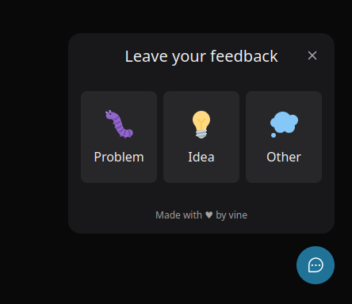
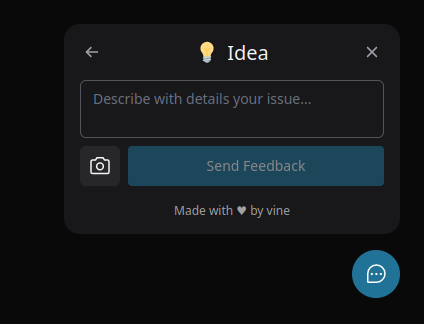

# **Feedbacker**

## Feedbacker - A feedback widget
A smart and functional feedback widget for web and mobile apps.

**Status:** Functional (View *TODO.md* for ongoing improvements)

---
### Screenshots





### Sub projects

- [x] web app
- [x] mobile app
- [x] server
---
### SERVER

NODE.JS - EXPRESS - Prisma ORM - JEST

#### SERVER - Running local with mailtrap.io

Needed *server/.env* file:
```
DATABASE_URL="..."

MAILTRAP_USER="..."
MAILTRAP_PASS="..."
MAILTRAP_TEST_TO="Name <email@domain>"
```
Execute:
```
cd server
npm install
prisma migrate deploy
npm run dev
```
---
### WEB

NODE.JS - TYPESCRIPT - TailwindCSS
---
### MOBILE

EXPO - React Native

## Thanks to

### Rocketseat

Development started during the event "NLW Return Impulse" (May 2022)

---
### Author

**Vinícius Dutra**

[](https://www.linkedin.com/in/viniciusdesouzadutra/)
